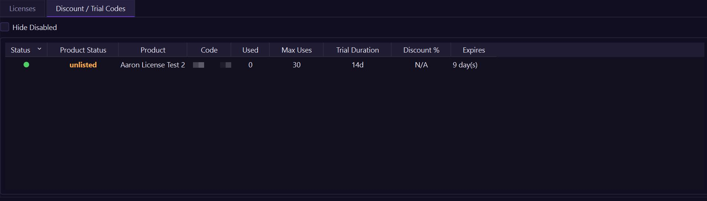
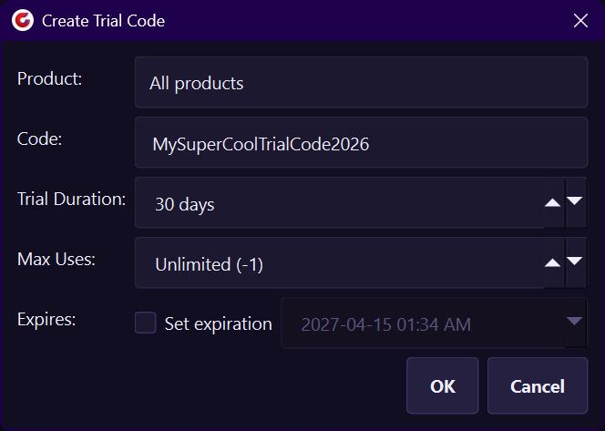
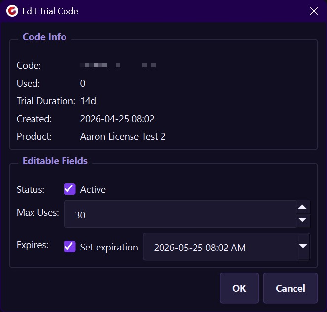
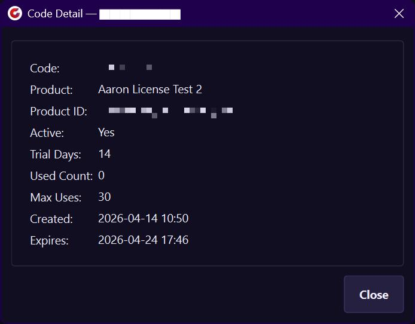

# CG Lounge - Creator License Manager

An admin interface for Creators to manage their Product Licenses and Discount/Trial codes hosted on CG Lounge.
Built with Python and PySide6.


---

> [!IMPORTANT]
> **The `master` branch is under active development**  
> It is **not stable** and may contain breaking changes, bugs, and unfinished features at any time.
>
> **✅ For stable, production-ready code, please use the latest release instead:**
>
> **[⬇️ Download Latest Stable Release](https://github.com/Nightingale13/CGLCreatorLicenseManager/releases/latest)**

[📋 Frequently Asked Questions](FAQ.md)

[📝 Change Log](CHANGELOG.md)

---
## Table of Contents
- 📋 [Requirements](#requirements)
- ⚙️ [Setup](#-setup)
  - ▶️ [Run](#1-run)
  - ⚙️ [Config (Optional)](#2-config-optional)
- 🖥️ [Interface Overview](#-interface-overview)
  - 🔧 [Toolbar](#toolbar-top)
  - ⏳ [Loading Bar](#loading-bar)
  - 📊 [Status Bar](#status-bar)
- 🔑 [Licenses](#-licenses)
  - ⚡ [License Action Buttons](#license-action-buttons-bottom)
  - 🟢 [License Statuses](#-license-statuses)
  - ⚠️ [Threat Levels](#-threat-levels)
  - ✏️ [Create / Edit License](#license-dialogs)
  - 🖱️ [Licenses Right-Click Menu](#licenses---right-click-context-menu)
  - 🔍 [License Detail](#license-detail)
- 🎟️ [Trials / Discounts](#-trials--discounts) (**This feature is under heavy active development.** 🛠️)
  - ⚡ [Trial/Discount Action Buttons](#trialdiscount-action-buttons-bottom)
  - ➕ [Create Trial/Discount Code](#create-trialdiscount-code)
  - 🖱️ [Trials/Discounts Right-Click Menu](#right-click-context-menu---trialsdiscounts)
  - ✏️ [Edit Trial / Discount Code](#edit-trial--discount-code)
  - 🔍 [Trials / Discount Detail](#trials--discount-detail)
- ⌨️ [Keyboard Shortcuts](#-keyboard-shortcuts)
- 📈 [Activation Counts](#-activation-counts)
- 👥 [Contributions](#-contributions)
---

## Requirements
- [Python 3.9](https://www.python.org/downloads/release/python-390) or newer
- [PySide6](https://pypi.org/project/PySide6)
```bash
pip install PySide6
```
---

## ⚙️ Setup
### 1. Run
```bash
python license_manager.py
```
A popup will appear asking for your Creator API Key. "`cgls_.....`".
Once entered, the app will pull your products, licenses, trials and discount codes.
### 2. Config (Optional)
After you enter your API Key, the app creates a `creator_secret.config` in the same location as `license_manager.py`.
This is the only location your API Key is stored - the app keeps no memory of it.
Deleting the `creator_secret.config` file will make the app prompt for a new API Key on launch.
#### creator_secret.config (example):
```config
API_KEY=cgls_..............................................................
SERVER_URL=
```
| Field        | Required | Description                                                                                                                                                                |
|--------------|----------|----------------------------------------------------------------------------------------------------------------------------------------------------------------------------|
| `API_KEY`    | Yes      | Your creator-scoped API key from the CG Lounge License Server dashboard.<br/><i>(Remember, you only need one for your Creator Account. All products use the same API Key.) |
| `SERVER_URL` | No       | Override the default server URL.                                                                                                                                           |
---

## 🖥️ Interface Overview


### Toolbar (top)


| Control             | Description                                                                                                                       |
|---------------------|-----------------------------------------------------------------------------------------------------------------------------------|
| **Product Status**  | Filter the table by product status, pulled from CG Lounge:<br/>🟢 **Active**, 🟠 **Unlisted**, 🟡 **Archived**                    |
| **Product**         | Filter the table by product name.                                                                                                 |
| **Search Bar**      | Filter table by `license key`, `email`, `country`, `trial/discount` `code` etc.                                                   |
| **Snap Tabs** ☑️    | Auto-resize the window to fit the current tab's column widths. Re-snaps when switching tabs or refreshing.                        |
| **Snap Centre** ☑️  | When Snap Tabs is on, re-centers the window on the current screen after each snap. Disabled unless Snap Tabs is checked.          |
| **Privacy Mode** ☑️ | Pixelates sensitive columns (key, email, productID, code, etc) in fields in dialogs.                                              |
| **Result counter**  | Shows how many licenses are currently visible/loaded.                                                                             |
| **? button**        | Opens this documentation in your browser.                                                                                         |
| **🐛 button**       | Opens the [GitHub Issues](https://github.com/Nightingale13/CGLCreatorLicenseManager/issues) page in your browser to report a bug. |

### Loading Bar
A thin purple progress bar appears below the table whenever a server request is in flight.
The cursor also changes to a wait cursor during this time. All API calls run on a background thread so the UI stays responsive.


### Status Bar
The status bar at the bottom of the window shows the result of the last action (e.g. "Loaded 42 licenses", "License updated.").
Errors appear in red with an 8-second timeout.
The right side of the status bar shows **"Dripping license statuses..."** while the background drip fetch is running, then swaps to a live countdown to the next automatic activation/violation refresh. [Activation Counts](#activation-counts)


---
## 🔑 Licenses
The Licenses tab shows all licenses for the selected product(s).


### License Filters:
| Checkbox             | Description                                     |
|----------------------|-------------------------------------------------|
| **Hide Trials** ☑️   | Toggle to hide trial-variant licenses.          |
| **Hide Disabled** ☑️ | Toggle to hide revoked and suspended licenses.  |
| **Hide Expired** ☑️  | Toggle to hide licenses past their expiry date. |

### License Columns:
| Column             | Description                                                                                                                            |
|--------------------|----------------------------------------------------------------------------------------------------------------------------------------|
| **Status**         | Colour-coded depending on the licenses current status, (see [License Statuses](#license-statuses)).                                    |
| **Product Status** | Displays the product status under which each key is assigned.                                                                          |
| **License Key**    | Truncated key — hover to see the full value.                                                                                           |
| **Email**          | Customer email address.                                                                                                                |
| **Tier**           | License variant (e.g. indie, studio).                                                                                                  |
| **Type**           | `per-machine`, `floating`, or `site`.                                                                                                  |
| **Sale Date**      | Purchase/Creation date.                                                                                                                |
| **Expires In**     | Time remaining, or "Perpetual".                                                                                                        |
| **Activations**    | Active machine count / max (updates automatically every 60 seconds).                                                                   |
| **Refunded**       | Yes if a refund or chargeback was processed.                                                                                           |
| **Disabled**       | Yes if the license is revoked or suspended.                                                                                            |
| **Expired**        | Yes if the license has passed its expiry date.                                                                                         |
| **Violations**     | Count of anti-piracy violations on record for the license. Shows `—` until the background drip fetch populates it (red text when > 0). |
| **Threat lvl**     | Anti-piracy threat level 0–4 (hover for description), (see [Threat Levels](#threat-levels))                                            |
| **Product**        | Product name from CG Lounge.                                                                                                           |
> Double-click any row to open the [License Detail](#license-detail) dialog.
> Right-click for the [context menu](#licenses---right-click-context-menu).
### License Action Buttons (bottom)


| Button                | Description                                                                             |
|-----------------------|-----------------------------------------------------------------------------------------|
| **Refresh**           | Reload all Licenses & Trials/Discounts from the server (also `F5`)                      |
| **+ Create License**  | Open the Create License Dialog (also `Ctrl+N`)                                          |
| **Edit Selected**     | Edit the selected license — variant, license type, max machines, status, and expiration |
| **View Details**      | Open the full detail view for the selected license                                      |
| **Revoke License**    | Permanently revoke the selected license(s)                                              |
| **Suspend License**   | Temporarily suspend the selected license(s)                                             |
| **Reinstate License** | Re-enable a revoked or suspended license                                                |
| **Reset Activations** | Delete all machine activations for the selected license(s), allowing fresh activations  |
| **Copy Key**          | Copy the license key(s) to clipboard                                                    |
> All destructive actions (Revoke, Suspend, Reset Activations) show a confirmation dialog before proceeding.
You can select multiple rows and act on them all at once.

### 🟢 License Statuses
The **License Status** column is updated automatically by the CG Lounge License Server's anti-piracy system.
However, you have full control to update any status in the License Manager by using the [Edit Dialog](#license-dialogs) or the [Action Buttons](#license-action-buttons-bottom) when a license is selected.

| Colour        | Status        | Description                                               |
|---------------|---------------|-----------------------------------------------------------|
| 🟢 **Green**  | **Active**    | License is valid and available for use.                   |
| 🟡 **Yellow** | **Degraded**  | Violations detected; still works but user sees a warning. |
| 🟠 **Orange** | **Suspended** | Temporarily blocked; access resumes after reinstatement.  |
| 🔴 **Red**    | **Revoked**   | Permanently disabled.                                     |
| ⚫ **Grey**    | **Expired**   | Past the expiry date.                                     |

### ⚠️ Threat Levels

The **Threat lvl** column is updated automatically by the CG Lounge License Server's anti-piracy system.
Hover over any cell to see the full description.

| Level    | Meaning                                                       |
|----------|---------------------------------------------------------------|
| 🟢 **0** | Clean — no violations.                                        |
| 🟡 **1** | Warning — minor suspicious activity, license still active.    |
| 🟠 **2** | Degraded — significant violations, nag message shown to user. |
| 🟠 **3** | Suspended — serious abuse, access blocked after 72 hours.     |
| 🔴 **4** | Revoked — chargeback or confirmed fraud, immediate block.     |

### License Dialogs
The **Create License** Dialog (or right-click → **Edit License**) to open the edit dialog.


| Create License   |                                                                                                                                                                                                                                        | Edit License        |                                                                                                                                                                                                                                                                                                                                                              |
|------------------|----------------------------------------------------------------------------------------------------------------------------------------------------------------------------------------------------------------------------------------|---------------------|--------------------------------------------------------------------------------------------------------------------------------------------------------------------------------------------------------------------------------------------------------------------------------------------------------------------------------------------------------------|
| **Product**      | List of your Products.                                                                                                                                                                                                                 | **Key**             | Full license key (selectable).                                                                                                                                                                                                                                                                                                                               |
| **Email**        | Email the license is registered to.                                                                                                                                                                                                    | **Email**           | Email the license is registered to.                                                                                                                                                                                                                                                                                                                          |
| **Variant**      | List of Variants/Tiers pulled from your Product.                                                                                                                                                                                       | **Product**         | The Product the license is for.                                                                                                                                                                                                                                                                                                                              |
| **License Type** | License type, this is linked to the Variant/Tier.                                                                                                                                                                                      | **Status**          | Current status at the time the dialog was opened.                                                                                                                                                                                                                                                                                                            |
| **Max Machines** | Maximum concurrent activations. The number is pulled from each Varaint/Tier on your Product.<br><br> It is **recommended** to keep these set the same as all other licenses for this variation/tier, though adjusting it is supported. | **Created**         | Purchase/Creation date.                                                                                                                                                                                                                                                                                                                                      |
| **Expires**      | Enable the checkbox to set an expiration date and time.                                                                                                                                                                                | **Editable Fields** |                                                                                                                                                                                                                                                                                                                                                              |
|                  |                                                                                                                                                                                                                                        | **Variant**         | Change the license tier of an existing key. Tiers/Variants are loaded from your Product in CG Lounge. It is **recommended** to match your tiers/variations `max machines` with what you offer in those tiers/variants.<br><br>🔴 **@TODO** While "Upgrading" can be performed here, there is no additional pricing or sale support as of the latest release. |
|                  |                                                                                                                                                                                                                                        | **Max Machines**    | Maximum concurrent activations. The number is pulled from each Varaint/Tier on your Product.<br><br> It is **recommended** to keep these set the same as all other licenses for this variation/tier, though adjusting it is supported.                                                                                                                       |                                                                                |
|                  |                                                                                                                                                                                                                                        | **Status**          | Manually set to `active`, `degraded`, `suspended`, or `revoked`.                                                                                                                                                                                                                                                                                             |                                                                                |
|                  |                                                                                                                                                                                                                                        | **Expires**         | Enable the checkbox to set an expiration date and time.                                                                                                                                                                                                                                                                                                      |                                                                                |
> **Edit Dialog:** Only fields that were actually changed are sent to the server. (These are highlighted in orange) Clicking **OK** with no changes will do nothing.

### Licenses - Right-Click Context Menu
Right-clicking any row shows a context menu with the same actions as the bottom buttons.


### License Detail
Double-click a row (or click **View Details**) to open the detail dialog. It has three tabs:


| Overview                          | Activations                                                                                                                                                                                                                 | Violations                                                                                                                           |
|-----------------------------------|-----------------------------------------------------------------------------------------------------------------------------------------------------------------------------------------------------------------------------|--------------------------------------------------------------------------------------------------------------------------------------|
| All stored fields for the license | List of active machines with fingerprint, hostname, country, and session info. Live filter: type a hostname or country to narrow the list, or enable **Only active sessions** to show only machines with an active session. | Anti-piracy violation records with type, severity, and detection time. Use the **Resolve Selected** button to clear false positives. |

---

## 🎟️ Trials / Discounts

> [!CAUTION]
> **Trials and Discounts are currently under heavy active development!**  
> Current Beta release does not include this. **Trials/Discounts** planned for v1.0.0 public release.

The Trials/Discounts tab shows all trial and discount codes for the selected product(s).


### Trials / Discounts Filters:
| Checkbox             | Description                                     |
|----------------------|-------------------------------------------------|
| **Hide Disabled** ☑️ | Toggle to hide revoked and suspended licenses.  |

### Trials / Discounts Columns:
| Column             | Description                                                             |
|--------------------|-------------------------------------------------------------------------|
| **Status**         | Colour-coded dot: active, expired or disabled.                          |
| **Product Status** | Product status from CG Lounge (Active / Unlisted / Archived).           |
| **Product**        | Product name the code applies to (or `All Products`).                   |
| **Code**           | The trial or discount code string.                                      |
| **Used**           | Number of times the code has been redeemed.                             |
| **Max Uses**       | Maximum redemptions allowed (`-1` = unlimited).                         |
| **Trial Duration** | Length of the trial granted, e.g. `14d`. `N/A` for discount-only codes. |
| **Discount %**     | Discount percentage applied at checkout. `N/A` for trial-only codes.    |
| **Expires**        | Expiry date/time for the code itself, or `Perpetual`.                   |
> Double-click any row to open the Trials/Discount Detail dialog.
> Right-click for the [context menu](#right-click-context-menu---trialsdiscounts).

### Trial/Discount Action Buttons (bottom)


| Button                | Description                                                                       |
|-----------------------|-----------------------------------------------------------------------------------|
| **Refresh**           | Reload all products, licenses, and codes from the server (also `F5`).             |
| **+ Create Trial**    | Open the Create Trial Dialog (also `Ctrl+N` when this tab is active).             |
| **+ Create Discount** | Open the Create Discount Dialog (also `Ctrl+Shift+N` when this tab is active).    |
| **Edit Selected**     | Edit the selected code — max uses, trial duration, discount percent, expiry, etc. |
| **View Details**      | Open the full detail view for the selected code.                                  |
| **Enable / Disable**  | Toggle the selected code(s) on or off without deleting them.                      |
| **Delete Code**       | Permanently delete the selected code(s).                                          |
| **Copy Code**         | Copy the code string(s) to the clipboard.                                         |
> Destructive actions (Delete) show a confirmation dialog before proceeding.
You can select multiple rows and act on them all at once.


### Create Trial/Discount Code


> Setting **Product** to `All Products` creates a code that applies to every product on your creator account.

### Right-Click Context Menu - Trials/Discounts
Right-clicking any row shows a context menu with the same actions as the bottom buttons.


### Edit Trial / Discount Code

Select a row and click **Edit Selected** (or right-click → **Edit Code**) to open the edit dialog.



#### The top section shows read-only code info for reference:

| Field              | Description                                           |
|--------------------|-------------------------------------------------------|
| **Code**           | The code string (selectable).                         |
| **Used**           | Number of times the code has already been redeemed.   |
| **Trial Duration** | Trial length granted by this code, or `N/A`.          |
| **Discount %**     | Discount percentage applied at checkout, or `N/A`.    |
| **Created**        | Creation date of the code.                            |
| **Product**        | Product name the code applies to (or `All Products`). |

#### The editable fields section allows the following changes:

| Field          | Description                                                                                             |
|----------------|---------------------------------------------------------------------------------------------------------|
| **Status**     | Toggle the `Active` checkbox to enable or disable the code without deleting it.                         |
| **Max Uses**   | Maximum allowed redemptions (`-1` = unlimited).                                                         |
| **Expires**    | Enable the checkbox to set an expiration date and time for the code itself.                             |

> Only fields that were actually changed are sent to the server. Clicking **OK** with no changes will do nothing.

### Trials / Discount Detail

Double-click a row (or click **View Details**) to open the detail dialog showing all stored fields for the code — code string, product(s) it applies to, trial duration, discount percent, usage counts, creation and expiry dates, and the code's current active/disabled state.



---

## ⌨️ Keyboard Shortcuts

| Shortcut       | Action                                                                                         |
|----------------|------------------------------------------------------------------------------------------------|
| `F5`           | Refresh all (products, licenses, trials/discounts)                                             |
| `Ctrl+N`       | Create new license on the **Licenses** tab, or new trial on the **Discount / Trial Codes** tab |
| `Ctrl+Shift+N` | Create new discount code on the **Discount / Trial Codes** tab                                 |
---

## 📈 Activation Counts
The CG Lounge License Server's list endpoint does not return live activation counts or violation counts. The app fetches them automatically in the background via a single `getLicense` call per row (activations and violations come from the same response).


- **After every refresh** — counts are dripped one license at a time at 50ms intervals to avoid overloading the server. The drip follows the **current table sort/filter order**, so visible rows fill in first.
- **During the drip** — the status bar shows `Dripping license statuses...` and the 60-second refresh timer is paused.
- **Every 60 seconds** — once the drip finishes, a background timer re-fetches all counts automatically. A live countdown in the bottom-right status bar shows when the next refresh is due.
- **On detail view** — opening the **View Details** dialog for a license fetches its activations and violations immediately and updates that row.
---
## For more information, see below:
- [Licensing Handbook](https://cglounge.studio/handbook/licensing).
- [CG Lounge API Docs](https://cglicenseserver.vercel.app).

## 👥 Contributions
- [Aaron Strasbourg](https://www.aaronstrasbourgvfx.ca/) - Original code for the Creator Manager.
- [Arvid Schneider](https://www.arvidschneider.com/) - Huge special thanks for creating CG Lounge and all the API work!
