# CG Lounge - Creator License Manager

An admin interface for Creators to manage their Product Licenses and Trial Codes hosted on CG Lounge.
Built with Python and PySide6.


---

> [!IMPORTANT]
> **The `master` branch is under active development**  
> It may contain breaking changes, bugs, and unfinished features at any time.
>
> **✅ For stable, production-ready code, please use the latest release instead:**
>
> **[⬇️ Download Latest Stable Release](https://github.com/Nightingale13/CGLCreatorLicenseManager/releases/latest)**

[📋 Frequently Asked Questions](FAQ.md)

[📝 Change Log](CHANGELOG.md)

---
## Table of Contents
- 📋 [Requirements](#requirements)
- ⚙️ [Setup](#-setup)
  - ▶️ [Run](#1-run)
  - ⚙️ [Config (Optional)](#2-config-optional)
- 🖥️ [Interface Overview](#-interface-overview)
  - 🔧 [Toolbar](#toolbar-top)
  - ⏳ [Loading Bar](#loading-bar)
  - 📊 [Status Bar](#status-bar)
- 🔑 [Licenses](#-licenses)
  - ⚡ [License Action Buttons](#license-action-buttons-bottom)
  - 🖱️ [Licenses Right-Click Menu](#licenses---right-click-context-menu)
  - 🟢 [License Statuses](#-license-statuses)
  - ⚠️ [Threat Levels](#-threat-levels)
  - ✏️ [Create / Edit License](#license-dialogs)
  - 🔍 [License Detail](#license-detail)
- 🎟️ [Trial Codes](#-trial-codes)
  - ⚡ [Trial Code Action Buttons](#trial-code-action-buttons-bottom)
  - 🖱️ [Trial Codes Right-Click Menu](#right-click-context-menu---trial-codes)
  - 🟢 [Trial Code Statuses](#-trial-code-statuses)
  - ✏️ [Create / Edit Trial Code](#trial-dialogs)
- ⌨️ [Keyboard Shortcuts](#-keyboard-shortcuts)
- 📈 [Activation Counts](#-activation-counts)
- 👥 [Contributions](#-contributions)
---

## Requirements
- [Python 3.9](https://www.python.org/downloads/release/python-390) or newer
- [PySide6](https://pypi.org/project/PySide6)
```bash
pip install PySide6
```
---

## ⚙️ Setup
### 1. Run
```bash
python license_manager.py
```
A popup will appear asking for your Creator API Key. "`cgls_.....`".
Once entered, the app will pull your products, licenses, and trial codes.
### 2. Config (Optional)
After you enter your API Key, the app creates a `creator_secret.config` in the same location as `license_manager.py`.
This is the only location your API Key is stored - the app keeps no memory of it.
Deleting the `creator_secret.config` file will make the app prompt for a new API Key on launch.
#### creator_secret.config (example):
```config
API_KEY=cgls_..............................................................
SERVER_URL=
```
| Field        | Required | Description                                                                                                                                                                |
|--------------|----------|----------------------------------------------------------------------------------------------------------------------------------------------------------------------------|
| `API_KEY`    | Yes      | Your creator-scoped API key from the CG Lounge License Server dashboard.<br/><i>(Remember, you only need one for your Creator Account. All products use the same API Key.) |
| `SERVER_URL` | No       | Override the default server URL.                                                                                                                                           |
---

## 🖥️ Interface Overview


### Toolbar (top)
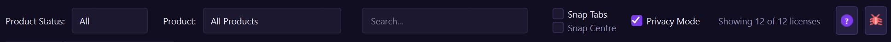

| Control             | Description                                                                                                                          |
|---------------------|--------------------------------------------------------------------------------------------------------------------------------------|
| **Product Status**  | Filter the table by product status, pulled from CG Lounge:<br/>🟢 **Active**, 🟠 **Unlisted**, 🟡 **Archived**                       |
| **Product**         | Filter the table by product name.                                                                                                    |
| **Search Bar**      | Filter by license key, email, tier, status, or product ID (Licenses tab); or by code, product name, or product ID (Trial Codes tab). |
| **Snap Tabs** ☑️    | Auto-resize the window to fit the current tab's column widths. Re-snaps when switching tabs or refreshing.                           |
| **Snap Centre** ☑️  | When Snap Tabs is on, re-centers the window on the current screen after each snap. Disabled unless Snap Tabs is checked.             |
| **Privacy Mode** ☑️ | Pixelates sensitive columns (key, email, productID, code, etc) in fields in dialogs.                                                 |
| **Result counter**  | Shows how many licenses are currently visible/loaded.                                                                                |
| **? button**        | Opens this documentation in your browser.                                                                                            |
| **🐛 button**       | Opens the [GitHub Issues](https://github.com/Nightingale13/CGLCreatorLicenseManager/issues) page in your browser to report a bug.    |

### Loading Bar
A thin purple progress bar appears below the table whenever a server request is in flight.
The cursor also changes to a wait cursor during this time. All API calls run on a background thread so the UI stays responsive.

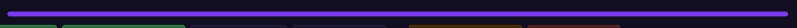

### Status Bar
The status bar at the **bottom left** of the window shows the result of the last action (e.g. "Loaded 42 licenses", "License updated.").
Errors appear in red with an 8-second timeout.


The status bar on the **right side** shows a live countdown to the next automatic activation and violation refresh. [Activation Counts](#-activation-counts)

---
## 🔑 Licenses
The Licenses tab shows all licenses for the selected product(s).
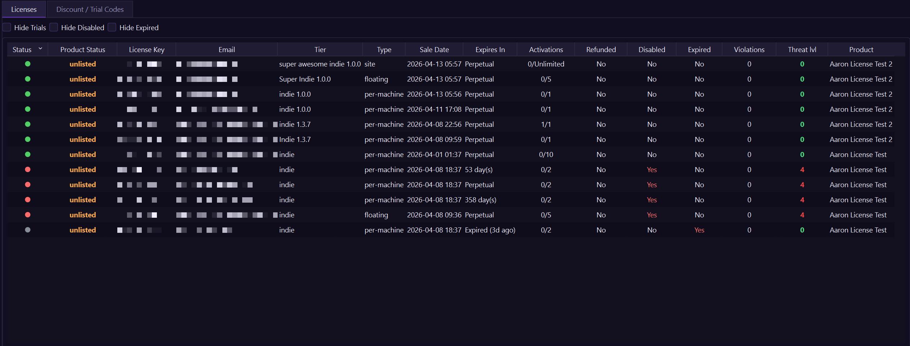

### License Filters:
| Checkbox             | Description                                     |
|----------------------|-------------------------------------------------|
| **Hide Trials** ☑️   | Toggle to hide trial-variant licenses.          |
| **Hide Disabled** ☑️ | Toggle to hide revoked and suspended licenses.  |
| **Hide Expired** ☑️  | Toggle to hide licenses past their expiry date. |

### License Columns:
| Column             | Description                                                                                                                            |
|--------------------|----------------------------------------------------------------------------------------------------------------------------------------|
| **Status**         | Colour-coded depending on the license's current status (see [License Statuses](#-license-statuses)).                                   |
| **Product Status** | Displays the product status under which each key is assigned.                                                                          |
| **License Key**    | Truncated key — hover to see the full value.                                                                                           |
| **Email**          | Customer email address.                                                                                                                |
| **Tier**           | License variant (e.g. indie, studio).                                                                                                  |
| **Type**           | `per-machine`, `floating`, or `site`.                                                                                                  |
| **Sale Date**      | Purchase/Creation date.                                                                                                                |
| **Expires In**     | Time remaining, or "Perpetual".                                                                                                        |
| **Activations**    | Active machine count / max (updates automatically every 60 seconds).                                                                   |
| **Refunded**       | Yes if a refund or chargeback was processed.                                                                                           |
| **Disabled**       | Yes if the license is revoked or suspended.                                                                                            |
| **Expired**        | Yes if the license has passed its expiry date.                                                                                         |
| **Violations**     | Count of unresolved anti-piracy violations. Populated immediately on every load (red text when > 0).                                   |
| **Threat lvl**     | Anti-piracy threat level 0–4 (hover for description, see [Threat Levels](#-threat-levels)).                                            |
| **Product**        | Product name from CG Lounge.                                                                                                           |
> Double-click any row to open the [License Detail](#license-detail) dialog.
> Right-click for the [context menu](#licenses---right-click-context-menu).

### License Action Buttons (bottom)
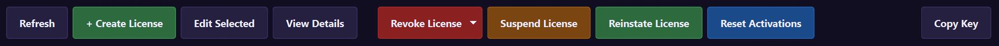

| Button                | Description                                                                              |
|-----------------------|------------------------------------------------------------------------------------------|
| **Refresh**           | Reload all licenses and trial codes from the server (also `F5`).                         |
| **+ Create License**  | Open the Create License dialog (also `Ctrl+N`).                                          |
| **Edit Selected**     | Edit the selected license — variant, license type, max machines, status, and expiration. |
| **View Details**      | Open the full detail view for the selected license.                                      |
| **Revoke License**    | Opens a submenu with three permanent revoke options (see below).                         |
| **Suspend License**   | Temporarily suspend the selected license(s).                                             |
| **Reinstate License** | Re-enable a revoked or suspended license.                                                |
| **Reset Activations** | Delete all machine activations for the selected license(s), allowing fresh activations.  |
| **Copy Key**          | Copy the license key(s) to clipboard.                                                    |
> All destructive actions (Revoke, Suspend, Reset Activations) show a confirmation dialog before proceeding.
You can select multiple rows and act on them all at once.

**Revoke License options:**

| Option               | Reason      | Description                                          |
|----------------------|-------------|------------------------------------------------------|
| **Revoke**           | `manual`    | Generic admin revoke.                                |
| **Revoke as Fraud**  | `fraud`     | Admin flagged the license as fraudulent.             |
| **Cancel License**   | `cancelled` | Order cancelled outside the payment flow.            |

### Licenses - Right-Click Context Menu
Right-clicking any row shows a context menu with the same actions as the bottom buttons.

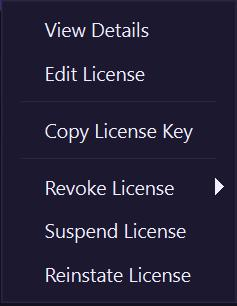

### 🟢 License Statuses
The **License Status** column is updated automatically by the CG Lounge License Server's anti-piracy system.
However, you have full control to update any status in the License Manager by using the [Edit Dialog](#license-dialogs) or the [Action Buttons](#license-action-buttons-bottom) when a license is selected.

| Colour        | Status        | Description                                               |
|---------------|---------------|-----------------------------------------------------------|
| 🟢 **Green**  | **Active**    | License is valid and available for use.                   |
| 🟡 **Yellow** | **Degraded**  | Violations detected; still works but user sees a warning. |
| 🟠 **Orange** | **Suspended** | Temporarily blocked; access resumes after reinstatement.  |
| 🔴 **Red**    | **Revoked**   | Permanently disabled.                                     |
| ⚫ **Grey**    | **Expired**   | Past the expiry date.                                     |

### ⚠️ Threat Levels

The **Threat lvl** column is updated automatically by the CG Lounge License Server's anti-piracy system.
Hover over any cell to see the full description.

| Level    | Meaning                                                       |
|----------|---------------------------------------------------------------|
| 🟢 **0** | Clean — no violations.                                        |
| 🟡 **1** | Warning — minor suspicious activity, license still active.    |
| 🟠 **2** | Degraded — significant violations, nag message shown to user. |
| 🟠 **3** | Suspended — serious abuse, access blocked after 72 hours.     |
| 🔴 **4** | Revoked — chargeback or confirmed fraud, immediate block.     |

### License Dialogs
Use **+ Create License** to open the create dialog, or select a row and click **Edit Selected** (or right-click → **Edit License**) to open the edit dialog.

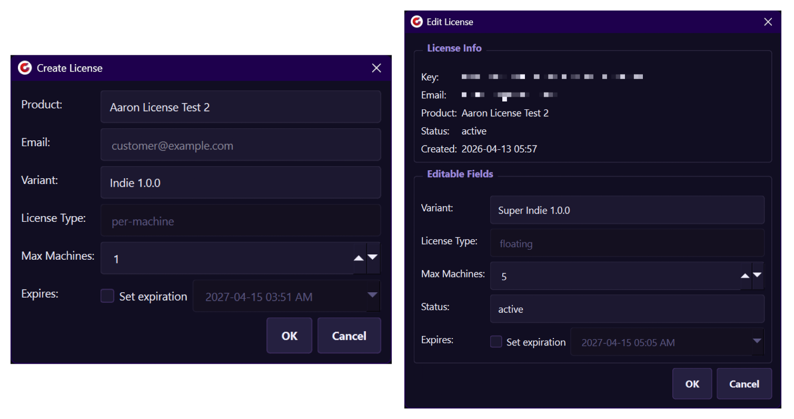

| Create License   |                                                                                                                                                                                                                                     | Edit License     |                                                                                                                                                                                                                                                                   |
|------------------|-------------------------------------------------------------------------------------------------------------------------------------------------------------------------------------------------------------------------------------|------------------|-------------------------------------------------------------------------------------------------------------------------------------------------------------------------------------------------------------------------------------------------------------------|
| **Product**      | List of your Products.                                                                                                                                                                                                              | **Key**          | Full license key (selectable).                                                                                                                                                                                                                                    |
| **Email**        | Email the license is registered to.                                                                                                                                                                                                 | **Email**        | Email the license is registered to.                                                                                                                                                                                                                               |
| **Variant**      | List of Variants/Tiers pulled from your Product.                                                                                                                                                                                    | **Product**      | The Product the license is for.                                                                                                                                                                                                                                   |
| **License Type** | License type, linked to the selected Variant/Tier.                                                                                                                                                                                  | **Status**       | Current status at the time the dialog was opened.                                                                                                                                                                                                                 |
| **Max Machines** | Maximum concurrent activations. The number is pulled from each Variant/Tier on your Product.<br><br>It is **recommended** to keep these set the same as all other licenses for this variant/tier, though adjusting it is supported. | **Created**      | Purchase/Creation date.                                                                                                                                                                                                                                           |
| **Expires**      | Enable the checkbox to set an expiration date and time.                                                                                                                                                                             | **Variant**      | Change the license tier of an existing key. Tiers/Variants are loaded from your Product in CG Lounge.<br><br>While "Upgrading a license" can be performed here, there is no additional pricing or sale support as of the latest release.                          |
|                  |                                                                                                                                                                                                                                     | **License Type** | License type, linked to the selected Variant/Tier.                                                                                                                                                                                                                |
|                  |                                                                                                                                                                                                                                     | **Max Machines** | Maximum concurrent activations. The number is pulled from each Variant/Tier on your Product.<br><br>It is **recommended** to keep this matching with the tier/variant that was originally offered to be fair to your customers, though adjusting it is supported. |
|                  |                                                                                                                                                                                                                                     | **Status**       | Manually set to `active`, `degraded`, `suspended`, or `revoked`.                                                                                                                                                                                                  |
|                  |                                                                                                                                                                                                                                     | **Expires**      | Enable the checkbox to set an expiration date and time.                                                                                                                                                                                                           |
> **Edit Dialog — Change Tracking:**
> - 🟠 **Orange border** — the field has been edited from its original value.
> - 🟡 **Yellow border** — the field has not been edited, but its current value does not match the variant/tier default (e.g. a custom Max Machines value).
> - A hint label appears below **Max Machines** when the value differs from the variant default (e.g. *"Default for Indie is 2"*).
> - A confirmation dialog appears when saving with a **Max Machines** value that differs from the variant default.
> - Only fields that were actually changed are sent to the server. Clicking **OK** with no changes will do nothing.

### License Detail
Double-click a row (or click **View Details**) to open the detail dialog. It has three tabs:

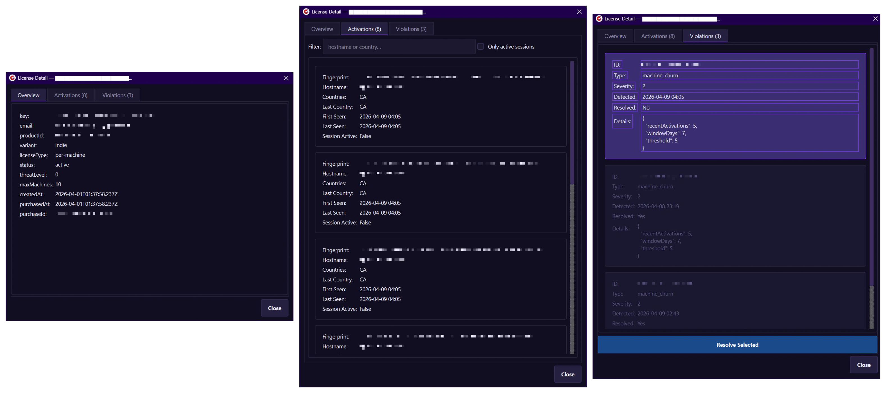

| Overview                          | Activations                                                                                                                                                                                                                 | Violations                                                                                                                           |
|-----------------------------------|-----------------------------------------------------------------------------------------------------------------------------------------------------------------------------------------------------------------------------|--------------------------------------------------------------------------------------------------------------------------------------|
| All stored fields for the license | List of active machines with fingerprint, hostname, country, and session info. Live filter: type a hostname or country to narrow the list, or enable **Only active sessions** to show only machines with an active session. | Anti-piracy violation records with type, severity, and detection time. Use the **Resolve Selected** button to clear false positives. |

---

## 🎟️ Trial Codes

Trial codes give customers a free trial period (e.g. 14 days) for a specific product.
When a customer redeems a code, the server creates a time-limited license for them automatically.

The Trial Codes tab shows all trial codes for the selected product(s).

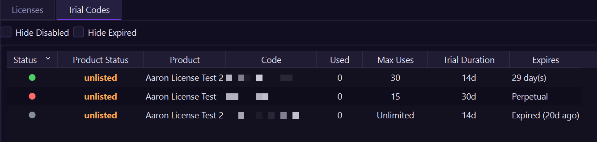

### Trial Codes Filters:
| Checkbox             | Description                                              |
|----------------------|----------------------------------------------------------|
| **Hide Disabled** ☑️ | Toggle to hide manually disabled codes.                  |
| **Hide Expired** ☑️  | Toggle to hide codes that have passed their expiry date. |

### Trial Code Columns:
| Column             | Description                                                                                                                         |
|--------------------|-------------------------------------------------------------------------------------------------------------------------------------|
| **Status**         | Colour-coded dot showing the current state of the code (see [Trial Code Statuses](#-trial-code-statuses)). Hover for a description. |
| **Product Status** | Product status from CG Lounge (Active / Unlisted / Archived).                                                                       |
| **Product**        | Product name the code applies to.                                                                                                   |
| **Code**           | The trial code string customers enter at checkout.                                                                                  |
| **Used**           | Number of times the code has been redeemed.                                                                                         |
| **Max Uses**       | Maximum redemptions allowed (`Unlimited` if no limit is set).                                                                       |
| **Trial Duration** | Length of the free trial granted when the code is redeemed (e.g. `14d`).                                                            |
| **Expires**        | Expiry date of the code itself, or `Perpetual` if no expiry is set.                                                                 |
> Double-click any row to open the [Trial Code Detail](#trial-code-detail) dialog.
> Right-click for the [context menu](#right-click-context-menu---trial-codes).

### Trial Code Action Buttons (bottom)
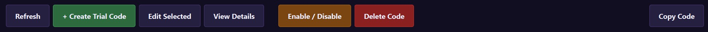

| Button                   | Description                                                                       |
|--------------------------|-----------------------------------------------------------------------------------|
| **Refresh**              | Reload all products, licenses, and trial codes from the server (also `F5`).       |
| **+ Create Trial Code**  | Open the Create Trial Code dialog (also `Ctrl+N` when this tab is active).        |
| **Edit Selected**        | Edit the selected code — active state, max uses, and expiry.                      |
| **View Details**         | Open the full detail view for the selected code.                                  |
| **Enable / Disable**     | Toggle the selected code(s) on or off without deleting them.                      |
| **Delete Code**          | Permanently delete the selected code(s).                                          |
| **Copy Code**            | Copy the code string(s) to the clipboard.                                         |
> Destructive actions (Delete) show a confirmation dialog before proceeding.
You can select multiple rows and act on them all at once.

### Right-Click Context Menu - Trial Codes
Right-clicking any row shows a context menu with the same actions as the bottom buttons.

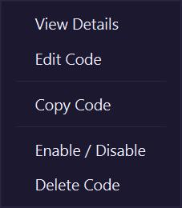

### 🟢 Trial Code Statuses

| Colour        | Status        | Description                                                  |
|---------------|---------------|--------------------------------------------------------------|
| 🟢 **Green**  | **Active**    | Code is valid and available for redemption.                  |
| 🟡 **Yellow** | **Maxed Out** | All available redemptions have been used.                    |
| 🔴 **Red**    | **Disabled**  | Code has been manually deactivated.                          |
| ⚫ **Grey**    | **Expired**   | Code has passed its expiration date.                         |

Hover over any status dot to see a description.

### Trial Dialogs

Click **+ Create Trial Code** (or `Ctrl+N` on the Trial Codes tab) to open the create dialog.
Select a row and click **Edit Selected** (or right-click → **Edit Code**) to open the edit dialog.
Double-click a row (or click **View Details**) to open the detail dialog showing all stored fields for the code — code string, product, trial duration, usage counts, creation and expiry dates, and the code's current active state.

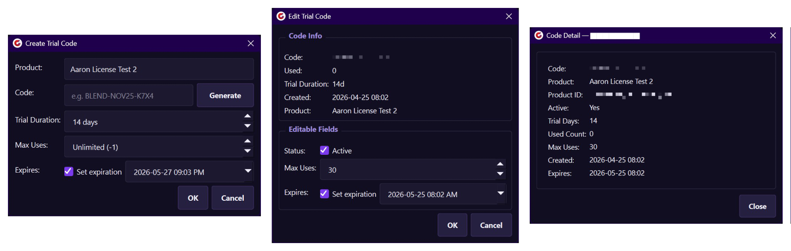

| Create Code        |                                                                                                       | Edit Code               |                                                                                 | View Code      |                                                                    |
|--------------------|-------------------------------------------------------------------------------------------------------|-------------------------|---------------------------------------------------------------------------------|----------------|--------------------------------------------------------------------|
| **Product**        | The product this trial code applies to. Each trial code is tied to a specific product.                | **Code**                | The code string (selectable).                                                   | **Code**       | The code string (selectable).                                      |
| **Code**           | The code string customers will enter. Type one manually or click **Generate** to create a random one. | **Used**                | Number of times the code has already been redeemed.                             | **Product**    | Product name the code applies to.                                  |
| **Trial Duration** | How many days of free access the code grants when redeemed. Defaults to **14 days**.                  | **Trial Duration**      | Trial length granted by this code.                                              | **Product ID** | The ID of the product in CG Lounge.                                |
| **Max Uses**       | Maximum number of times the code can be redeemed (`-1` = Unlimited).                                  | **Created**             | Creation date of the code.                                                      | **Active**     | Yes if the code is currently available for redemption.             |
| **Expires**        | Expiry date for the code itself. Enabled by default, set to **30 days from today**.                   | **Product**             | Product name the code applies to.                                               | **Trial Days** | How many days of free access the code grants when redeemed.        |
|                    |                                                                                                       | **Status (Editable)**   | Toggle the `Active` checkbox to enable or disable the code without deleting it. | **Used Count** | Number of times the code has already been redeemed.                |
|                    |                                                                                                       | **Max Uses (Editable)** | Maximum allowed redemptions (`-1` = Unlimited).                                 | **Max Uses**   | Maximum allowed redemptions (`-1` = Unlimited).                    |
|                    |                                                                                                       | **Expires (Editable)**  | Enable the checkbox to set an expiration date and time for the code itself.     | **Created**    | Creation date of the code.                                         |
|                    |                                                                                                       |                         |                                                                                 | **Expires**    | The day this trial code will expire and can no longer be redeemed. |

> **Generate button:** Clicking Generate creates a randomised code using a mix of random characters, product name hints, and date fragments. Click it multiple times to get different variations. Generated codes are always checked against existing codes for the selected product to avoid duplicates.

> **Edit Dialog — Change Tracking:**
> - 🟠 **Orange border** — the field has been edited from its original value.
> - Only fields that were actually changed are sent to the server. Clicking **OK** with no changes will do nothing.

---

## ⌨️ Keyboard Shortcuts

| Shortcut | Action                                                                                             |
|----------|----------------------------------------------------------------------------------------------------|
| `F5`     | Refresh all (products, licenses, trial codes).                                                     |
| `Ctrl+N` | Create new license on the **Licenses** tab, or create a new trial code on the **Trial Codes** tab. |
---

## 📈 Activation Counts
Activation counts (`machinesUsed`) and unresolved violation counts (`unresolvedViolationsCount`) are returned directly by `listLicenses` — both columns are populated immediately on every load with zero extra server calls.


- **After every refresh** — activation and violation counts are available instantly; no background drip is needed.
- **Every 60 seconds** — a background timer re-runs `listLicenses` to keep counts current. A live countdown in the bottom-right status bar shows when the next refresh is due.
- **On detail view** — opening the **View Details** dialog for a license fetches its full activation list and live violation details, and updates that row's counts immediately.
---
## For more information, see below:
- [Licensing Handbook](https://cglounge.studio/handbook/licensing).
- [CG Lounge API Docs](https://cglicenseserver.vercel.app).

## 👥 Contributions
- [Aaron Strasbourg](https://www.aaronstrasbourgvfx.ca/) - Original code for the Creator License Manager.
- [Arvid Schneider](https://www.arvidschneider.com/) - Huge special thanks for creating [CG Lounge](https://cglounge.studio/) and all the API work!!