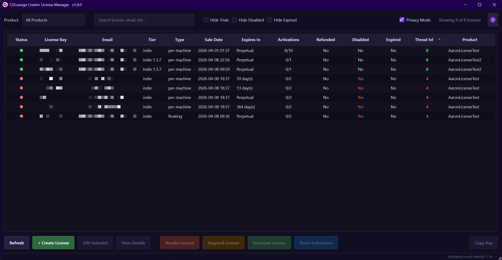
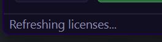
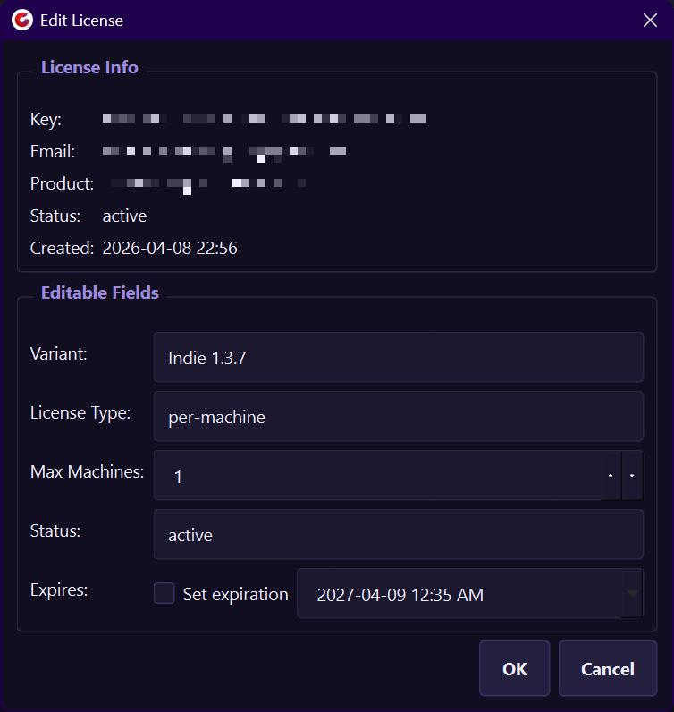
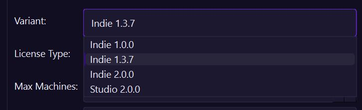
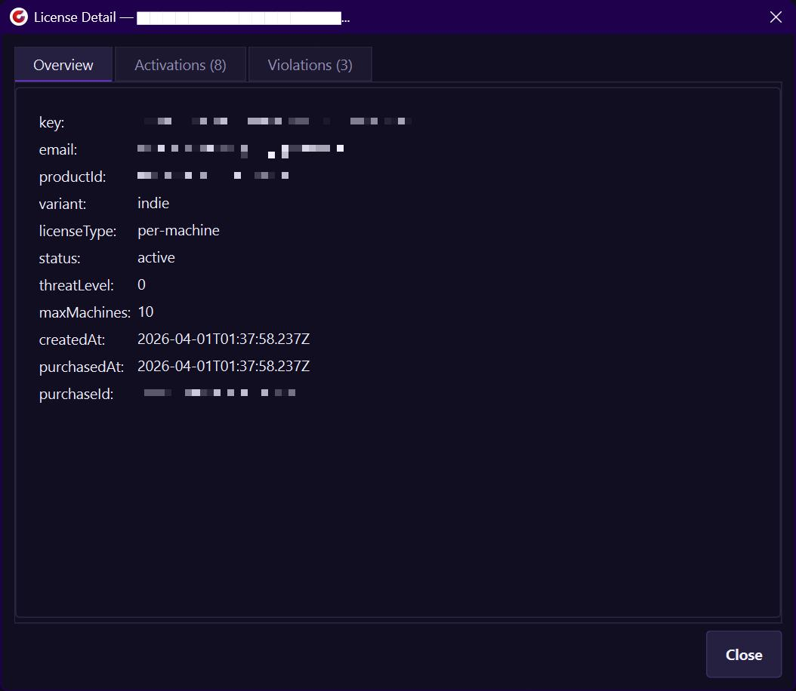
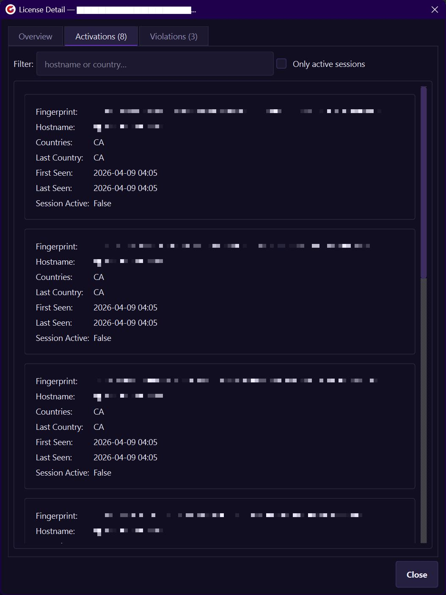
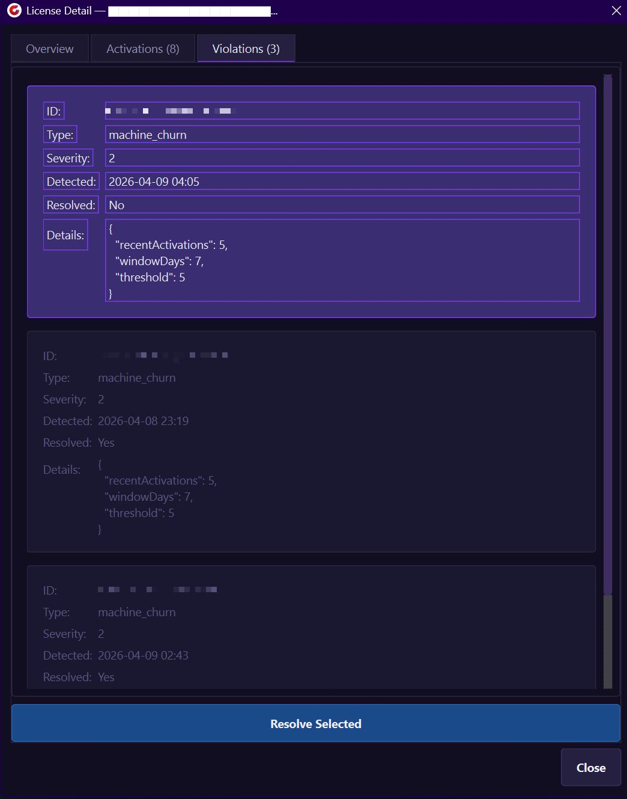
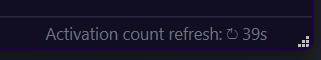

# CG Lounge - Creator License Manager

A desktop admin tool for managing licenses issued by the CG Lounge License Server. Built with Python and PySide6.


---

## Requirements

- [Python 3.9](https://www.python.org/downloads/release/python-390/) or newer
- [PySide6](https://pypi.org/project/PySide6/)

```bash
pip install PySide6
```

---

## Setup

### 1. Configure `config.json`

A template `config.json` is included. Open it and fill in your details:

```json
{
    "apiKey": "cgls_your_creator_api_key",
    "products": {
        "My Plugin": {
            "productId": "your-product-id"
        },
        "Another Product": {
            "productId": "another-product-id"
        }
    }
}
```

| Field | Required | Description |
|---|---|---|
| `apiKey` | Yes | Your creator-scoped API key from the CG Lounge License Server dashboard |
| `products` | Yes | Map of display name → `{ "productId": "..." }` |
| `serverUrl` | No | Override the default server URL |

You can add as many products as you like. They will all appear in the product filter dropdown.

### 2. Run

```bash
python license_manager.py
```

---

## Interface Overview



### Toolbar (top)

| Control | Description |
|---|---|
| **Product dropdown** | Filter the table to a single product, or show all |
| **Search box** | Live search across key, email, variant, status, and product ID |
| **Hide Trials** | Toggle to hide trial-variant licenses |
| **Hide Disabled** | Toggle to hide revoked and suspended licenses |
| **Hide Expired** | Toggle to hide licenses past their expiry date |
| **Privacy Mode** | Pixelates sensitive columns (key, email) and fields in dialogs |
| **Result counter** | Shows how many licenses are currently visible |
| **? button** | Opens the documentation in your browser |

### License Table (center)

The table shows all licenses for the selected product(s). Click any column header to sort. Click it again to reverse the sort order. The default sort is by **Threat Level** (descending) so the most concerning licenses surface last.

| Column | Description |
|---|---|
| **Status** | Colour-coded dot (see [Status Colours](#status-colours)) |
| **License Key** | Truncated key — hover to see the full value |
| **Email** | Customer email address |
| **Tier** | License variant (e.g. indie, studio) |
| **Type** | `per-machine`, `floating`, or `site` |
| **Sale Date** | Purchase or creation date |
| **Expires In** | Time remaining, or "Perpetual" |
| **Activations** | Active machine count / max (updates automatically every 60 seconds) |
| **Refunded** | Yes if a refund or chargeback was processed |
| **Disabled** | Yes if the license is revoked or suspended |
| **Expired** | Yes if the license has passed its expiry date |
| **Threat lvl** | Anti-piracy threat level 0–4 (hover for description) |
| **Product** | Product name from your config |

Double-click any row to open the [License Detail](#license-detail) dialog.

Sort preferences (column and direction) are saved automatically and restored on next launch.

### Action Buttons (bottom)

| Button | Description |
|---|---|
| **Refresh** | Reload all licenses from the server (also `F5`) |
| **+ Create License** | Open the create dialog (also `Ctrl+N`) |
| **Edit Selected** | Edit the selected license — variant, license type, max machines, status, and expiration |
| **View Details** | Open the full detail view for the selected license |
| **Revoke License** | Permanently revoke the selected license(s) |
| **Suspend License** | Temporarily suspend the selected license(s) |
| **Reinstate License** | Re-enable a revoked or suspended license |
| **Reset Activations** | Delete all machine activations for the selected license(s), allowing fresh activations |
| **Copy Key** | Copy the license key(s) to clipboard |

All destructive actions (Revoke, Suspend, Reset Activations) show a confirmation dialog before proceeding. You can select multiple rows and act on them all at once.

### Right-Click Context Menu

Right-clicking any row shows a context menu with the same actions as the bottom buttons.

### Loading Bar

A thin purple progress bar appears below the table whenever a server request is in flight. The cursor also changes to a wait cursor during this time. All API calls run on a background thread so the UI stays responsive.

### Status Bar



The status bar at the bottom of the window shows the result of the last action (e.g. "Loaded 42 licenses", "License updated."). Errors appear in red with an 8-second timeout. The right side of the status bar shows a live countdown to the next automatic activation count refresh.

---

## Status Colours

| Colour | Status | Description |
|---|---|---|
| 🟢 **Green** | **Active** | License is valid and in use |
| 🟡 **Yellow** | **Degraded** | Violations detected; still works but user sees a warning |
| 🟠 **Orange** | **Suspended** | Temporarily blocked; access resumes after reinstatement |
| 🔴 **Red** | **Revoked** | Permanently disabled |
| ⚫ **Grey** | **Expired** | Past the expiry date |

---

## Threat Levels

The **Threat lvl** column is updated automatically by the CG Lounge License Server's anti-piracy system. Hover any cell to see the full description.

| Level | Meaning |
|---|---|
| 0 | Clean — no violations |
| 1 | Warning — minor suspicious activity, license still active |
| 2 | Degraded — significant violations, nag message shown to user |
| 3 | Suspended — serious abuse, access blocked after 72 hours |
| 4 | Revoked — chargeback or confirmed fraud, immediate block |

---

## Edit License

Select a row and click **Edit Selected** (or right-click → **Edit License**) to open the edit dialog.



The top section shows read-only license info for reference:

| Field | Description |
|---|---|
| **Key** | Full license key (selectable) |
| **Email** | Customer email address |
| **Product** | Product ID from your config |
| **Status** | Current status at the time the dialog was opened |
| **Created** | Creation date |

The editable fields section allows the following changes:

| Field | Description |
|---|---|
| **Variant** | Change the license tier (loaded from the server for the product) |
 | This is useful for licensing versions of a product. (You will need to hookup version validation in your custom licensing setup for your plugin.)
| **License Type** | Switch between `per-machine`, `floating`, and `site` |
| **Max Machines** | Maximum concurrent activations (`-1` = unlimited). Automatically set to `1` when switching to per-machine, `5` for floating, and unlimited for site |
| **Status** | Manually set to `active`, `degraded`, `suspended`, or `revoked` |
| **Expires** | Enable the checkbox to set an expiration date and time |

Only fields that were actually changed are sent to the server. Clicking **OK** with no changes will do nothing.

---

## License Detail

Double-click a row (or click **View Details**) to open the detail dialog. It has three tabs:
- **Overview** — all stored fields for the license

- **Activations** — list of active machines with fingerprint, hostname, country, and session info

- **Violations** — anti-piracy violation records with type, severity, and detection time. Use the **Resolve Selected** button to clear false positives.


---

## Keyboard Shortcuts

| Shortcut | Action |
|---|---|
| `F5` | Refresh licenses |
| `Ctrl+N` | Create new license |

---

## Activation Counts

The CG Lounge License Server's list endpoint does not return live activation counts. The app fetches them automatically in the background in two ways:



- **After every refresh** — activation counts are fetched one license at a time at 50ms intervals to avoid overloading the server.
- **Every 60 seconds** — a background timer re-fetches all counts automatically. A live countdown in the bottom-right status bar shows when the next refresh is due.
- **On detail view** — opening the **View Details** dialog for a license fetches its activations immediately and updates that row.

The **Activations** tab inside the detail dialog has a live filter: type a hostname or country to narrow the list, or enable **Only active sessions** to show only machines with an active session.

---

## Troubleshooting

**"No products configured"** — Make sure `config.json` is in the same folder as `license_manager.py` and contains at least one entry under `products`.

**Table shows 0/N activations** — The counts load in the background after the initial list. Wait a few seconds for them to populate, or open the detail view for a specific license to update it immediately.

**Authentication errors** — Double-check your `apiKey` value. It must be a creator-scoped key (starts with `cgls_`). You only have to create this once; every product uses the same `apiKey`.

**For more information** — please read the follwoing docs:
- [Licensing Handbook](https://cglounge.studio/handbook/licensing).
- [CG Lounge API Docs](https://cglicenseserver.vercel.app).
